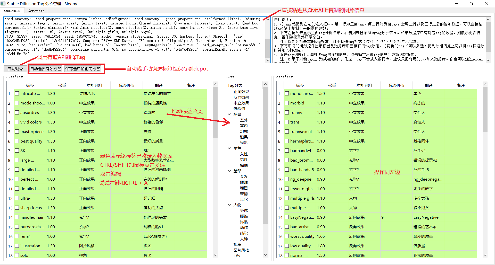

# StableDiffusionTagsManager

### 注意：本软件主要通过cursor辅助生成，不代表本人的代码和设计风格。



这个工具用来辅组学习和分析Stable Diffusion的Prompts（tags），并且对tags进行管理以便于自己使用。 已完成了基本的分析和生成功能。

使用方法写在程序界面上。软件规划和详细的需求可以使用 [FreeReq](https://github.com/SleepySoft/FreeReq) 打开doc/requirement.req查看。

---------------------------------------------------------

对功能的思考（20230508）：

这个程序从基本功能上来说已经实现了我最初的设想，不过还有一些细节功能没有做好：

1. 权重和特殊用法的分析，特别是LoRA的分析。
2. 最初的设计就是Tag翻译后不会自动保存，以免将低质量的翻译写入数据库中。但实现和使用起来有一系列问题，观感不好。
3. 交互的细节还有不少问题，特别是控件间的拖动操作

但从使用的体验来说，还远没达到我理想中的水平。最近一直在思考这个问题，得到的结论是：

+ 光积累Tas其实对于提升出图水平提升有限。Tags库更多的价值是针对分析和微调，而非系统地设计。

+ 不同的tag组合以及在不同的模型上的应用效果差别会非常大，缘木求鱼无法达到好的效果。如何才能帮助使用者真正地激发灵感？

+ 想要玩得花，还得靠LoRA。对于LoRA的支持，比如触发关键字的辅助，还没法实现（需要爬虫收集数据）。

当前能想到的一个改进点是“素材收集”。也即是除了保存孤立的tag之外，还需要支持保存tag的组合（Prompts）以及的信息：比如对这段Prompts的评价，以及它最初应用的模型。

从使用上来说，应当是将参考的Prompts移除了通用的Tag之后，把其精华的部分保存成一个独立的文件。在后期创作的时候可以通过浏览这些文件寻找灵感和批量引入tag。就如同搭积木一样，把一幅幅小场景组合起来。这应该比直接从一个个Tag入手更有效率吧。

如果大家有意见或建议，请告诉我。

---------------------------------------------------------

如何运行该程序：

```
pip install -r requirements.txt -i https://pypi.tuna.tsinghua.edu.cn/simple
python main.py
```

欢迎加wx群，互相交流（瑟）图炼制与炼丹心得：


